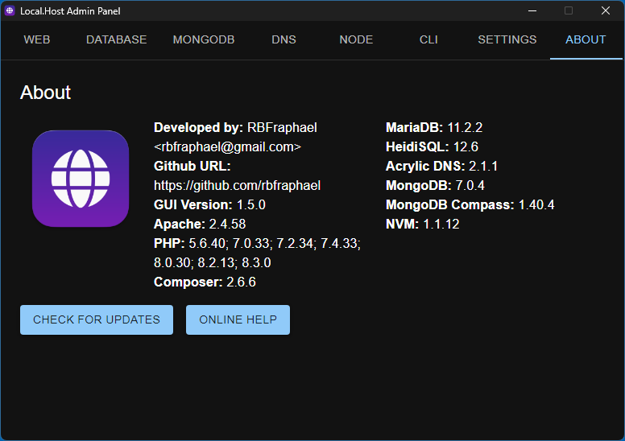
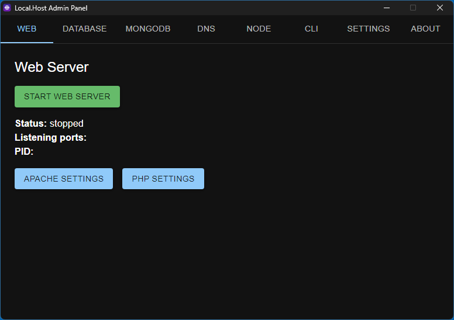
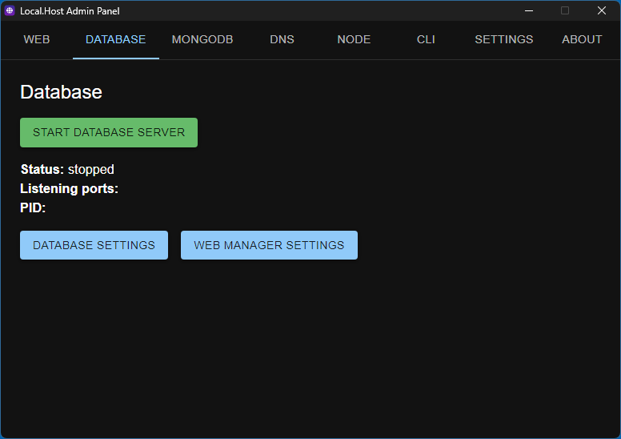
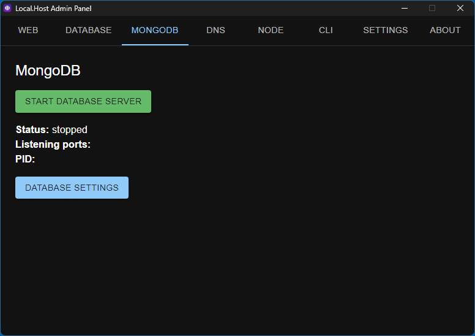
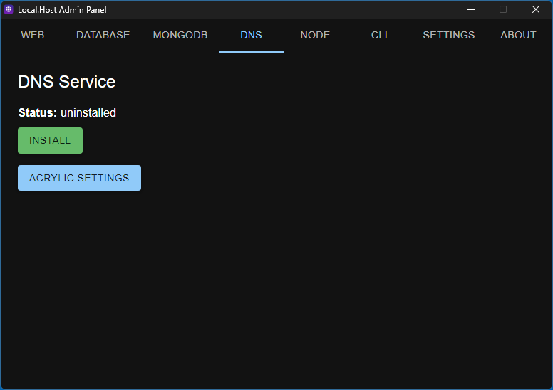
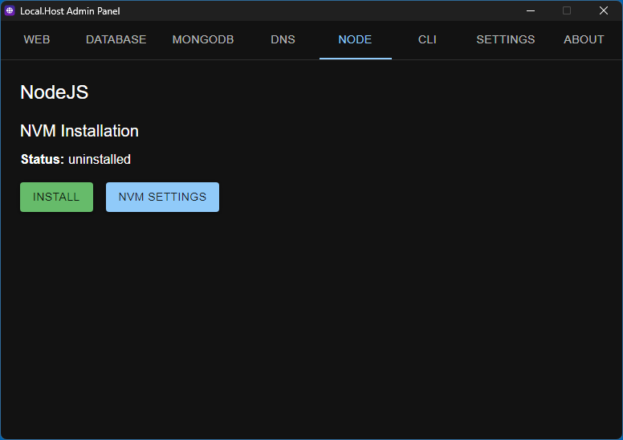
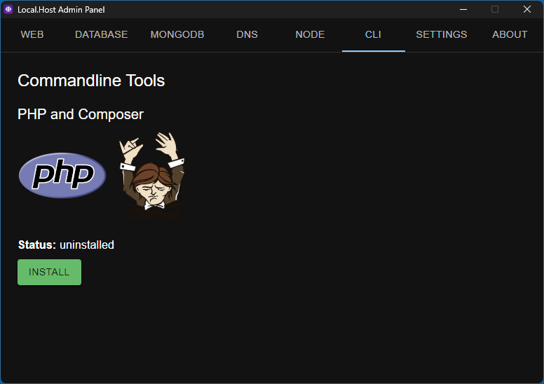
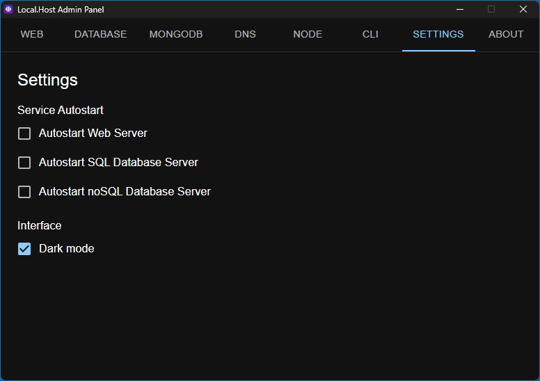

# Local.Host
## Your XAMPP alternative with multi-PHP, built-in DNS and dynamic 3-level subdomain support


Local.Host is a XAMPP alternative for Windows that brings you multi-PHP support, a built-in DNS and a easy-to-use dynamic 3-level subdomain setup on Apache. It runs in top of Apache, MariaDB and Acrylic DNS.

The admin panel is built with [Electron](https://www.electronjs.org/) with [NextJS](https://nextjs.org/) and [Material UI](https://mui.com/).


* * *



* * *

## Web Server



The bundled web server in Local.Host is Apache 2.4.57, with some custom configurations that are covered above.

#### Multi PHP Support

Bundled with Local.Host, there are 7 PHP versions: 5.6, 7.0, 7.2, 7.4, 8.0, 8.2 and 8.3. By default, PHP version 8.3 will respond on Apache requests, but you can change it by setting the needed PHP version in .htaccess. Just copy the snippet bellow and change the PHPXX\_CGI variable according.

```apache
<Files ~ "\.php$">
    FcgidWrapper ${PHP83_CGI} .php
</Files>
```

#### Dynamic Subdomains

When using the bundled DNS server (Acrylic DNS Proxy), you have a top-level domain http://local.host, and can dynamically create 3-level subdomains just creating folders on the www (the document root directory) folder. The above table explains how dynamic subdomains work on this folder tree.

|Directory|URL|
|----|----|
|www|http://local.host|
|www\\folder|http://folder.local.host|
|www\\folder\\subfolder|http://subfolder.folder.local.host|
|www\\folder\\subfolder\\subsubfolder|http://subsubfolder.subfolder.folder.local.host|
|www\\client|http://client.local.host|
|www\\client\\project|http://project.client.local.host|
|www\\client\\project\\admin|http://admin.project.client.local.host|
|www\\client\\project\\api|http://api.project.client.local.host|

* * *

## SQL Database Server



MariaDB is the bundled database server within Local.Host. You can just start the database server and use it with some client (like phpMyAdmin, Heidi SQL, MySQL Workbench or any other) and websites. Also, all bundled PHP versions have MySQL/MySQLi extensions enabled by default. 

There is a bundled phpMyAdmin version already configured included with Local.Host that you can easily access though the control panel.

* * *

## NoSQL Database Server



MongoDB is included with Local.Host, and you can use any MongoDB client to access. For convenience, Local.Host also includes MongoDB Compass, which is the recommended way to access MongoDB.

* * *

## DNS Server



To explore the dynamic subdomains feature, you need to use the pre-configured bundled version of Acrylic DNS. First, install the service (through the control panel), then you need to configure your computer to use 127.0.0.1 as the DNS server. You can check how to manage that [here](https://www.windowscentral.com/how-change-your-pcs-dns-settings-windows-10). It's a easy process and you will not use more than 2 minutes on that. Also, after installing the Acrylic DNS as a service on your computer, it will start automatically on each boot.

* * *

## Node Version Manager (NVM)



NVM is a version manager for NodeJS. With NVM, you can have multiple NodeJS versions installed, which you can easy switch between then with one command line instruction. To learn more about NVM, [check out this GitHub repository](https://github.com/coreybutler/nvm-windows).

* * *

## CLI Extras



As a PHP developer, you should know about Composer. Composer is a PHP package manager (like PIP for Python or NPM for NodeJS). Local.Host includes Composer, and you can install it on your system from the "CLI" tab. Also, installing Composer to your system, you will be able to run phpX.X commands from your terminal application.

* * *

## Settings



With Local.Host settings, you can toggle the UI theme between dark and light modes. Also, you can set Web Server (Apache) and/or Database servers (MariaDB and MongoDB) to automatically start when you open Local.Host.